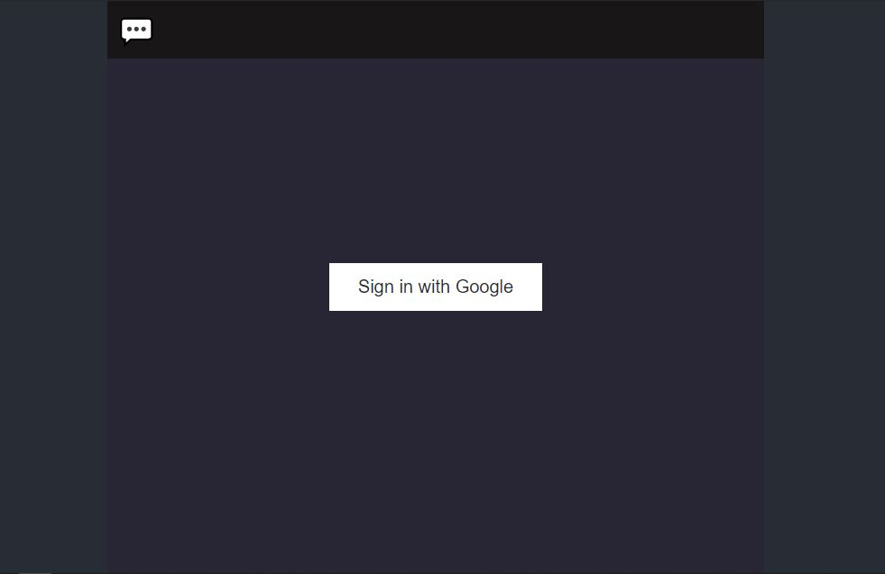

<h1 align="center"> REAL TIME Chatting Authentication with Google hehehe 🔥 </h1> 

<p align="center"> 
    </img>
</p>

<p align="center">
  <a href="https://app.netlify.com/sites/akhfas-messager-clone/deploys"></a>
  <a href="https://www.npmjs.com/package/npm/v/6.13.4"></a>
  <a href="https://nodejs.org/en/blog/release/v12.13.0/"></a>
  <a href="https://reactjs.org/"></a>
  <a href="https://firebase.google.com/docs/firestore"></a>

  <!-- Untuk melihat contoh langsung, **[click here](https://ashutosh1919.github.io/)** -->

# Clone dan Gunakan 😀😀😀
- Clone repositori  menggunakan perintah berikut:
   ```python
     git clone https://github.com/akhfasarrofi/chat-authentication-with-goole.git
    ```
- Jalankan perintah berikut untuk mengunduh dependensi yang dibutuhkan:
   ```python
    npm install
    ``` 
    Buat project di **[firebase](https://firebase.google.com/docs)** dan aktifkan untuk metode authentikasi nya dengan Google
- Ganti isi file ```src/App.js``` dan isi dengan firebase config anda:
   ```python
    firebase.initializeApp({
    /* your config */
    })
    ```   
- Sekarang, proyek tersebut siap digunakan.
- Anda dapat memeriksanya menggunakan `npm start`, ini akan membuka situs Anda.

# Contribusi 💡

Jika Anda dapat membantu kami Jangan ragu untuk membuka [pull request](https://github.com/akhfasarrofi/chatting-authentication-google/pulls) atau [issue](https://github.com/akhfasarrofi/chatting-authentication-google/issues).

# Referensi 👏🏻

- Ide Desain dan ide Implementasi diambil dari [facebook-messager-clone](https://github.com/akhfasarrofi/facebook-messager-clone) yang dikembangkan.
